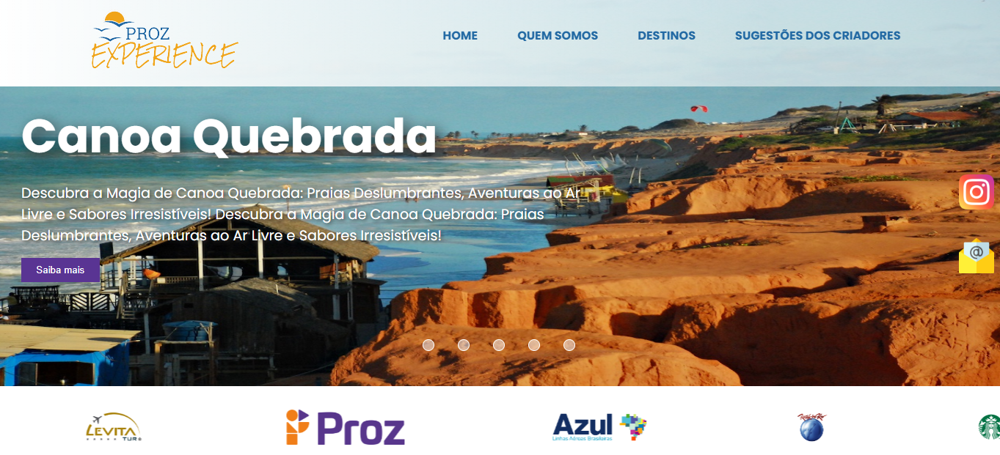

<h1 align="center">Proz Experience</h1>

Proz Experience é um site de turismo desenvolvido para o curso de Introdução à  Programação da escola <a href="https://prozeducacao.com.br/" target="_blank">Proz  Educação</a> .  

 

<h5 align="center">Logo</h5>

  

 

<h5 align="center">Página Inicial</h5>

  

 

## :star: Criadores
-  [Alisson Oliveira](https://github.com/devalissonoliveira)
-  [Bruna Ditrich](https://github.com/BrunaDitrich)
-  [Daniela Alves](https://github.com/daniela-ab)
-  [Hiago Miranda](https://github.com/Hiagomp)
-  [Tony Cajaiba](https://github.com/TonyCCintra)

 

## :pencil: Projeto

O site Proz Experience é um guia de turismo para destinos nacionais. Inicialmente conta com destinos sugeridos pelos criadores, que são de cidades e estados diferentes.
 

O projeto possui um filtro para a escolha de tipos de turismo: Turismo Tradicional, Ecoturismo ou Turismo Culinário.

 

## :computer: Tecnologias

Esse projeto está em desenvolvimento usando as seguintes tecnologias:

 

## :globe_with_meridians: Deploy do projeto
[Clique aqui](https://devalissonoliveira.github.io/projeto_integrador_proz/)
